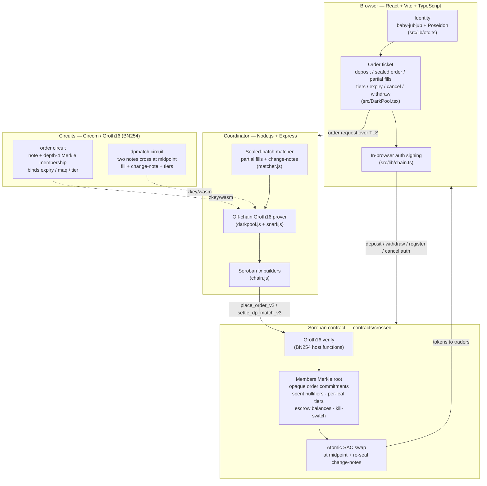

<div align="center">


# Crossed

**A zero-knowledge dark pool for token swaps on Stellar (Soroban).**
Post a *sealed limit order* — only an opaque commitment and a one-time nullifier ever touch the chain.
When two orders cross, a Groth16 proof is verified *inside* the smart contract and both legs settle atomically at the midpoint, with **partial fills** rolled forward as fresh sealed change-notes.

[](https://stellar.org)
[](https://developers.stellar.org/docs/build/smart-contracts/overview)
[](https://www.rust-lang.org)
[](https://docs.circom.io)
[](https://eprint.iacr.org/2016/260)
[](https://www.poseidon-hash.info)
[](https://github.com/iden3/snarkjs)
[](https://react.dev)
[](https://www.typescriptlang.org)
[](https://vitejs.dev)
[](https://nodejs.org)
[](#)

</div>

> Built for **Stellar Hacks: Real-World ZK**. The headline requirement — a zero-knowledge proof generated off-chain and verified on-chain — is met end-to-end and proven live on testnet.

---

## What it is

A **dark pool** lets traders place orders without revealing them to the market. Crossed brings that to Stellar with real cryptographic privacy instead of "trust us":

- **Sealed orders.** A trader posts a *limit order* (side, size, limit price), but the chain only ever sees an **opaque commitment** (`note`) plus a one-time **nullifier**. Side, size, and price are never written on-chain.
- **No leak if unmatched.** An order that doesn't cross simply rests as a commitment. Nobody — not other traders, not the public ledger — learns its terms.
- **No front-running within a batch.** Orders are matched in discrete **batch windows**. The operator cannot peek at, reorder, or trade ahead of a sealed order within its window.
- **Midpoint clearing.** When a buy and a sell cross, they execute at the **midpoint** of their two limit prices — a fair, uniform price for both sides.
- **Partial fills via change-notes.** A fill no longer has to consume the whole order. The match proof can settle a partial `fill_base`/`fill_quote`, and the unfilled remainder is re-sealed in place as a fresh opaque **change-note** — a new commitment that keeps resting, with its terms still hidden.
- **Counterparty tiers.** Each member leaf carries an on-chain **tier**. Orders bind the tier they will trade against, and settlement re-checks both parties' tiers on-chain — so a desk can keep retail and pro flow from crossing without revealing who is who.
- **Time-in-force & expiry.** Every order binds an `expiry` and a minimum-acceptable-quantity (`maq`) floor. Placement rejects an already-expired order; settlement re-checks expiry at execution time, so a stale order can never be filled.
- **On-chain cancellation.** A trader can cancel a resting sealed order on-chain with a cancel proof — closing the note and freeing its escrow without ever revealing what the order was.
- **Atomic settlement from escrow.** Funds are pre-deposited into on-chain escrow. Settlement debits both escrows and swaps both legs in a single contract call — both transfers succeed or neither does.
- **Kill-switch + always-open withdraw.** A guardian can pause `place_order`/`settle_dp_match` instantly. Withdraw is **never** gated by the pause — traders can always pull their own escrow back, even while the pool is frozen.

The privacy guarantee is enforced by a zero-knowledge proof: the contract releases funds **only** when it has verified, in zero knowledge, that the fill corresponds to a valid, price-compatible, tier-compatible, unexpired match of orders placed by registered members.

---

## Architecture



| Component | Path | Role |
|-----------|------|------|
| Soroban contract | [`contracts/crossed/src/lib.rs`](contracts/crossed/src/lib.rs) | Escrow, opaque order book, tiers, kill-switch, Groth16 verification, atomic midpoint swap, partial-fill change-notes |
| Order circuit | [`circuits/order_v2.circom`](circuits/order_v2.circom) | Proves a note is well-formed and its owner is a registered member; binds expiry, maq, tier |
| Match circuit | [`circuits/dpmatch_v2.circom`](circuits/dpmatch_v2.circom) | Proves two opaque notes cross at the midpoint and produces the fill + change-notes |
| Off-chain prover | [`coordinator/darkpool.js`](coordinator/darkpool.js) | Builds witnesses, generates + self-verifies Groth16 proofs, encodes proof bytes for Soroban |
| Batch matcher | [`coordinator/matcher.js`](coordinator/matcher.js) | Runs the sealed book, pairs crossing orders, drives place/settle, rolls partial fills into change-notes |
| Chain client | [`coordinator/chain.js`](coordinator/chain.js) | Soroban transaction builders, simulation, auth assembly |
| HTTP server | [`coordinator/server.js`](coordinator/server.js) | `/fund` `/mint` `/dp/register` `/dp/order` `/dp/cancel` `/dp/close` `/dp/batch` `/dp/fills` |
| Frontend | [`frontend/src/DarkPool.tsx`](frontend/src/DarkPool.tsx) | Order ticket: enter pool → deposit → sealed order → run match → fills → cancel/withdraw |
| Browser crypto | [`frontend/src/lib/otc.ts`](frontend/src/lib/otc.ts) | baby-jubjub + Poseidon identity, Merkle, in-browser signing |

---

## How the ZK works

Crossed uses Circom circuits compiled to Groth16 over the **BN254** curve and verified on-chain using Soroban's BN254 host functions (`bn254` pairing check + MSM). All hashing uses **Poseidon**; member identity is a **baby-jubjub** keypair; the directory is a **depth-4 Merkle tree** (capacity 16 members).

Domain-separation constants: `DOM_NFKEY=4`, `DOM_ORDER=9`, `DOM_NFORD=10`, `DOM_NFSPEND=11`, `DOM_MATCH=5`. Amounts and prices are integers in Stellar 7-decimal atomic units; price scale `PRICE_SCALE = 10_000_000` (`1.0 = 1e7`).

### Order circuit — [`order_v2.circom`](circuits/order_v2.circom)

Proves an order note is well-formed and its owner is a registered member, **without revealing side, size, or limit price**. An open order is fully opaque on-chain.

- Identity: `pk = sk·G` (baby-jubjub), `hsk = Poseidon(sk)`, `leaf = Poseidon(pk.x, pk.y, hsk)`.
- Membership: depth-4 Merkle inclusion of `leaf` under the on-chain members root.
- `note = Poseidon(DOM_ORDER, leaf, side, pair_id, size, limit_price, salt, batch_id, expiry, maq, tier)` — `batch_id`, `expiry`, the minimum-acceptable-quantity `maq`, and the counterparty `tier` are all bound into the commitment, so a note is cryptographically scoped to its auction window, its lifetime, its fill floor, and the tier it may trade against.
- `nf_order = Poseidon(DOM_NFORD, salt, note)` — a placement nullifier scoped to this one order. The browser proves this locally; the long-lived identity `sk` is not submitted to the coordinator.
- Range checks: `side ∈ {0,1}`, `size`/`limit_price` non-zero u64, `expiry`/`maq` bounded u64, `tier` bounded u32.

**Public signals:** `[ note, nf_order, pair_id, batch_id, root, expiry, maq, tier ]`

### Match circuit — [`dpmatch_v2.circom`](circuits/dpmatch_v2.circom)

Proves two opaque notes cross at the midpoint, revealing **only** executed-trade info — the two member leaves (which the contract maps to owner addresses) and the fill amounts. Limits, sizes, minimum-acceptable-quantities, tiers, and the crossing price stay hidden.

- Recomputes `note_sell` (side 0) and `note_buy` (side 1) from the client-submitted one-time order openings. Membership was already proven when each note was placed, and the contract requires both notes to be open.
- Enforces opposite sides, same `pair_id`, same `batch_id`, **distinct members** (`leaf_sell ≠ leaf_buy`, no self-trade), and price compatibility `limit_sell ≤ cross_price ≤ limit_buy`.
- Midpoint: `limit_sell + limit_buy == 2·cross_price + parity`, `parity ∈ {0,1}`.
- Fill respects each side's `maq` floor; the executed `fill_base` is bound to the proof.
- Fixed-point quote: `fill_base·cross_price == fill_quote·PRICE_SCALE + rem`, `0 ≤ rem < PRICE_SCALE`.
- Spend nullifiers: `nf_sell = Poseidon(DOM_NFSPEND, salt_sell, note_sell)`, `nf_buy` likewise.
- `match_id = Poseidon(DOM_MATCH, note_sell, note_buy, pair_id, batch_id, root)`.

**Public signals:** `[ match_id, note_sell, note_buy, nf_sell, nf_buy, leaf_sell, leaf_buy, fill_base, fill_quote, pair_id, batch_id, root ]`

> The match-proof public vector above is the locked interface verified by the contract. The on-chain settle entrypoint additionally takes the re-sealed `change_note_sell`/`change_note_buy` and the `assigned_tier_sell`/`assigned_tier_buy` it re-checks against the directory — see below.

### On-chain flow

1. **`place_order_v2(proof, note, nf_order, pair_id, batch_id, root, expiry, maq, tier)`** — requires the pool not be paused; verifies the order Groth16 proof against an accepted members root; rejects an already-expired order and a spent placement nullifier; then stores `note` as an open, opaque order record carrying its `batch_id`, `pair_id`, and `expiry`. No owner, side, size, or price is recorded or emitted. (`deposit_and_place_order` does the escrow deposit and order placement atomically in one trader-signed call.)
2. **`settle_dp_match_v3(proof, match_id, note_sell, note_buy, nf_sell, nf_buy, leaf_sell, leaf_buy, fill_base, fill_quote, change_note_sell, change_note_buy, assigned_tier_sell, assigned_tier_buy, pair_id, batch_id, root)`** — requires the pool not be paused; verifies the match Groth16 proof; requires both notes open, in-batch, unexpired, and unspent; **re-checks both parties' on-chain tiers** against `assigned_tier_*`; spends both nullifiers and marks the `match_id` used; resolves each owner address from its leaf via the on-chain directory; checks and debits escrow (seller's base, buyer's quote); atomically transfers `fill_base` SELLER→BUYER and `fill_quote` BUYER→SELLER; and re-seals any non-zero **change-note** as a fresh open order so the unfilled remainder keeps resting opaquely.
3. **`cancel_order_v2(...)`** — a trader closes a resting sealed order on-chain with a cancel proof, retiring the note without revealing its terms.
4. **`withdraw(owner, token, amount)`** — owner-authorized; **never gated by the kill-switch**, so escrow can always be reclaimed.

Both proofs are verified with `env.crypto().bn254()` — a real on-chain Groth16 pairing check, not a stub. Per-leaf tiers are administered by `set_tier`/`tier_of`; the kill-switch is `set_paused`/`set_guardian`; sensitive role changes (coordinator/guardian/admin) go through a `propose_*` → `execute_*` timelock.

---

## Privacy & trust model

**What the chain (and everyone else) sees:** opaque order commitments (including re-sealed change-notes), one-time nullifiers, the members Merkle root, per-leaf tiers, and — at settlement — the two leaves and fill amounts. Order side, size, limit price, and minimum-acceptable-quantity are never on-chain. Public escrow balances are visible.

**What is guaranteed cryptographically:**
- Order terms (price/size/side/maq) are hidden while resting; the chain only stores commitments.
- A partial fill's remainder stays hidden — it is re-sealed as a fresh opaque change-note, not revealed.
- The operator cannot front-run within a sealed batch.
- The coordinator **can never move funds** without a valid on-chain ZK proof *and* the trader's escrow having pre-authorized exactly that spend. A fill is bound by the proof to a valid, price-compatible, tier-compatible, unexpired match of the trader's own committed order, and the contract re-checks expiry and tiers at execution.
- A trader can always exit: withdraw is owner-authorized and never blocked by the pause.

**Honest-operator design.** This is a semi-trusted-coordinator design. The browser builds the order proof locally, so the coordinator never receives or stores the trader's long-lived pool identity `sk`. At batch close the coordinator *does* receive the one-time order opening (`leaf`, side, size, limit, salt, batch, expiry, maq, tier) needed to match and settle a submitted order, so it can read that order's terms in order to find crossings. On-chain authorization: `initialize`/`configure_pair`/`set_tier` require the owner/admin; `register` requires **both** `owner.require_auth()` (trader-signed) **and** `coordinator.require_auth()`; `place_order_v2`/`settle_dp_match_v3`/`cancel_order_v2` require `coordinator.require_auth()`; `set_paused` requires the guardian; `deposit`/`withdraw`/cancel require the funds owner.

**Known limitations (honest):**
- **Operator-blind matching (MPC / threshold decryption)** — the operator currently sees terms at batch close in order to match; design specs for closing this gap live under [`docs/`](docs/) (`CROSSED_V2_SPEC_operator-blind.md`).
- **Coordinator-attested Merkle root** — the members root is posted by the coordinator (no on-chain Poseidon frontier yet); flagged for hardening before mainnet.
- **Unlinkable deposits (shielded escrow pool)** — escrow balances are public and linkable.
- **Match-completeness / no-withholding** — each fill is sound in isolation, but nothing yet forces the coordinator to settle every crossable pair (see `docs/CROSSED_V2_SPEC_match-completeness.md`).
- **Testnet only** — experimental, unaudited, no real funds.

---

## Live on testnet

> **Source of truth:** [`docs/DEPLOYMENT.md`](docs/DEPLOYMENT.md). All live contract IDs, deploy txs, and verification records live there — that file wins if anything here drifts. (We deliberately do **not** hardcode a contract ID in this README.)

- **Network:** Stellar testnet — passphrase `Test SDF Network ; September 2015`, RPC `https://soroban-testnet.stellar.org`
- **Dark-pool contract (current):** see [`docs/DEPLOYMENT.md`](docs/DEPLOYMENT.md) (source of truth).
- **Configured pairs:** pair `1` USDC/XLM, `2` EURC/USDC, `3` USDT/USDC, `4` EURC/XLM, `5` USDT/XLM, `6` EURC/USDT.
- **Deployer / coordinator:** key alias `crossed-deployer` (address in [`docs/DEPLOYMENT.md`](docs/DEPLOYMENT.md)).

**Verified live** (see [`docs/DEPLOYMENT.md`](docs/DEPLOYMENT.md) for tx prefixes):
- Offline prover test (`node coordinator/darkpool_v2.test.js`) → **PASS**.
- On-chain v3 e2e (`node coordinator/dp_e2e_v2.js`) → **PASS** — atomic midpoint settlement via `settle_dp_match_v3`.
- Coordinator-path e2e (`COORDINATOR_URL=http://127.0.0.1:8790 node coordinator/dp_e2e.js`) → **PASS** on the current contract.
- Contract tests cover owner-authenticated sealed-order cancellation, wrong-owner rejection, tier mismatch rejection, expiry rejection, and the kill-switch (paused place/settle, still-open withdraw).

---

## Getting started

### Prerequisites
- Node.js (for the frontend + coordinator) and a [Stellar CLI](https://developers.stellar.org/docs/tools/developer-tools) install with a `crossed-deployer` key alias to run the live coordinator.
- For rebuilding the contract: the Rust toolchain + `stellar contract build`.
- The circuits are **prebuilt** (`circuits/build/`, `circuits/build_v2/`), so you do not need Circom/snarkjs to run the app.

### Frontend (Vite dev server on :5173)
```bash
cd frontend
npm install
npm run dev
```

### Coordinator (HTTP API on :8790)
Run as documented in [`docs/DEPLOYMENT.md`](docs/DEPLOYMENT.md) — it has the exact, current `OTC_CONTRACT_ID`/`DP_CONTRACT_ID` values (they must be equal; the DP register/post_root paths target the same contract). The shape of the command:
```bash
cd coordinator
npm install
COORDINATOR_SECRET="$(stellar keys show crossed-deployer)" \
  OTC_CONTRACT_ID=<see docs/DEPLOYMENT.md> \
  DP_CONTRACT_ID=<see docs/DEPLOYMENT.md> \
  PORT=8790 node server.js
```
On restart the coordinator rebuilds its in-memory directory from on-chain (`getRegistrations`) and re-posts the root — watch for `Synced N registration(s)`. Coordinator state auto-namespaces by contract id. API bearer auth is optional (`COORDINATOR_API_TOKEN`, off by default).

### Contract (rebuild)
```bash
cd contracts/crossed
stellar contract build
```

### Circuits
Compiled artifacts live in [`circuits/build/`](circuits/build/) (v1) and [`circuits/build_v2/`](circuits/build_v2/) (v2 order/dpmatch) — wasm witness generators, final zkeys, and verification keys produced with **Circom** + **snarkjs** (Groth16). The verifying keys are baked into the contract as fixtures.

---

## Verify it yourself

```bash
# 1) Offline prover — proves an order + match and self-verifies the Groth16 proofs.
node coordinator/darkpool_v2.test.js
# Proves order_v2 and dpmatch produce consistent, verifiable public signals
# (note == match.note_sell; midpoint clearing; fill + change-note encoding).

# 2) Live two-party e2e — needs the coordinator running on :8790.
node coordinator/dp_e2e_v2.js
# Funds two fresh accounts, registers both as members, deposits to escrow, places two sealed
# orders that cross, closes the batch, and asserts the on-chain atomic midpoint swap settled by
# settle_dp_match_v3 — both legs swap, any remainder re-sealed as a change-note.
```

---

## Repository layout

```text
.
├── contracts/      Soroban smart contract (Rust): escrow, opaque order book, tiers, kill-switch, Groth16 verify, atomic swap, change-notes
├── circuits/       Circom order + dpmatch circuits (v1 + v2) and prebuilt Groth16 artifacts (build/, build_v2/)
├── coordinator/    Node.js: HTTP API, sealed-batch matcher (partial fills), off-chain prover, Soroban tx builders
├── frontend/       React + Vite + TypeScript order-ticket UI and browser-side crypto
└── docs/           Deployment (source of truth), v2 design specs, roadmap, security notes
```

| Directory | Description |
|-----------|-------------|
| [`contracts/`](contracts/) | The `crossed` Soroban contract — `initialize`, `register`, `post_root`, `configure_pair`, `set_tier`, `set_paused`/`set_guardian`, timelocked `propose_*`/`execute_*`, `deposit`, `withdraw`, `place_order_v2`, `cancel_order_v2`, `settle_dp_match_v3`, plus the BN254 Groth16 verify path. |
| [`circuits/`](circuits/) | `order_v2.circom`, `dpmatch_v2.circom` (and v1 originals), witness/Poseidon/Merkle helpers, and prebuilt `build/` + `build_v2/` artifacts. |
| [`coordinator/`](coordinator/) | `server.js`, `chain.js`, `darkpool.js`, `matcher.js`, plus `darkpool_v2.test.js` and `dp_e2e_v2.js`. |
| [`frontend/`](frontend/) | `DarkPool.tsx`, `Landing.tsx`, `lib/chain.ts`, `lib/config.ts`, `lib/otc.ts`, and assets in `public/`. |
| [`docs/`](docs/) | `DEPLOYMENT.md` (source of truth), `CROSSED_V2_*` design specs + roadmap, design and security review notes. |

---

## Tech stack

- **Smart contract:** Rust (`no_std`), Soroban SDK, BN254 host functions for Groth16 verification, SAC token transfers.
- **Zero-knowledge:** Circom 2 circuits, Groth16 over BN254, Poseidon hashing, baby-jubjub identity, snarkjs proving.
- **Coordinator:** Node.js, Express, `@stellar/stellar-sdk`, circomlibjs.
- **Frontend:** React 18, TypeScript, Vite, `@stellar/stellar-sdk`, Stellar Wallets Kit, in-browser snarkjs + circomlibjs.

---

## License & disclaimer

Experimental hackathon software. **Testnet only — no real funds.** This code has not been audited and is **not** for production or mainnet use. It is an honest-operator dark-pool design with the known limitations documented above and in the [`docs/`](docs/) v2 specs. Use at your own risk.
</content>
</invoke>
