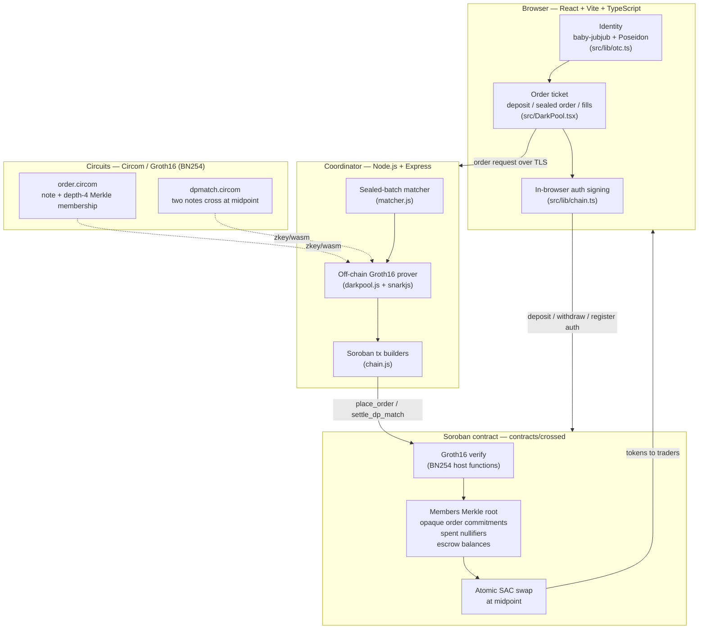

<div align="center">


# Crossed

**A zero-knowledge dark pool for token swaps on Stellar (Soroban).**
Post a sealed limit order — only an opaque commitment and a one-time nullifier ever touch the chain.
When two orders cross, a Groth16 proof is verified *inside* the smart contract and both legs swap atomically at the midpoint price.

[](https://stellar.org)
[](https://developers.stellar.org/docs/build/smart-contracts/overview)
[](https://www.rust-lang.org)
[](https://docs.circom.io)
[](https://eprint.iacr.org/2016/260)
[](https://www.poseidon-hash.info)
[](https://github.com/iden3/snarkjs)
[](https://react.dev)
[](https://www.typescriptlang.org)
[](https://vitejs.dev)
[](https://nodejs.org)
[](#)

</div>

> Built for **Stellar Hacks: Real-World ZK**. The headline requirement — a zero-knowledge proof generated off-chain and verified on-chain — is met end-to-end and proven live on testnet.

---

## What it is

A **dark pool** lets traders place orders without revealing them to the market. Crossed brings that to Stellar with real cryptographic privacy instead of "trust us":

- **Sealed orders.** A trader posts a *limit order* (side, size, limit price), but the chain only ever sees an **opaque commitment** (`note`) plus a one-time **nullifier**. Side, size, and price are never written on-chain.
- **No leak if unmatched.** An order that doesn't cross simply rests as a commitment. Nobody — not other traders, not the public ledger — learns its terms.
- **No front-running within a batch.** Orders are matched in discrete **batch windows**. The operator cannot peek at, reorder, or trade ahead of a sealed order within its window.
- **Midpoint clearing.** When a buy and a sell cross, they execute at the **midpoint** of their two limit prices — a fair, uniform price for both sides.
- **Atomic settlement from escrow.** Funds are pre-deposited into on-chain escrow. Settlement debits both escrows and swaps both legs in a single contract call — both transfers succeed or neither does.

The privacy guarantee is enforced by a zero-knowledge proof: the contract releases funds **only** when it has verified, in zero knowledge, that the fill corresponds to a valid, price-compatible match of orders placed by registered members.

---

## Architecture



| Component | Path | Role |
|-----------|------|------|
| Soroban contract | [`contracts/crossed/src/lib.rs`](contracts/crossed/src/lib.rs) | Escrow, opaque order book, Groth16 verification, atomic midpoint swap |
| Order circuit | [`circuits/order.circom`](circuits/order.circom) | Proves a note is well-formed and its owner is a registered member |
| Match circuit | [`circuits/dpmatch.circom`](circuits/dpmatch.circom) | Proves two opaque notes cross at the midpoint |
| Off-chain prover | [`coordinator/darkpool.js`](coordinator/darkpool.js) | Builds witnesses, generates + self-verifies Groth16 proofs, encodes proof bytes for Soroban |
| Batch matcher | [`coordinator/matcher.js`](coordinator/matcher.js) | Runs the sealed book, pairs crossing orders, drives place/settle |
| Chain client | [`coordinator/chain.js`](coordinator/chain.js) | Soroban transaction builders, simulation, auth assembly |
| HTTP server | [`coordinator/server.js`](coordinator/server.js) | `/fund` `/mint` `/dp/register` `/dp/order` `/dp/close` `/dp/batch` `/dp/fills` |
| Frontend | [`frontend/src/DarkPool.tsx`](frontend/src/DarkPool.tsx) | Order ticket: enter pool → deposit → sealed order → run match → fills |
| Browser crypto | [`frontend/src/lib/otc.ts`](frontend/src/lib/otc.ts) | baby-jubjub + Poseidon identity, Merkle, in-browser signing |

---

## How the ZK works

Crossed uses **two** Circom circuits, both compiled to Groth16 over the **BN254** curve and verified on-chain using Soroban's BN254 host functions (`bn254` pairing check + MSM). All hashing uses **Poseidon**; member identity is a **baby-jubjub** keypair; the directory is a **depth-4 Merkle tree** (capacity 16 members).

Domain-separation constants: `DOM_NFKEY=4`, `DOM_ORDER=9`, `DOM_NFORD=10`, `DOM_NFSPEND=11`, `DOM_MATCH=5`. Amounts and prices are integers in Stellar 7-decimal atomic units; price scale `PRICE_SCALE = 10_000_000` (`1.0 = 1e7`).

### Order circuit — [`order.circom`](circuits/order.circom)

Proves an order note is well-formed and its owner is a registered member, **without revealing side, size, or limit price**. An open order is fully opaque on-chain.

- Identity: `pk = sk·G` (baby-jubjub), `hsk = Poseidon(sk)`, `leaf = Poseidon(pk.x, pk.y, hsk)`.
- Membership: depth-4 Merkle inclusion of `leaf` under the on-chain members root.
- `note = Poseidon(DOM_ORDER, leaf, side, pair_id, size, limit_price, salt, batch_id)` — `batch_id` is bound in, so a note is cryptographically scoped to its auction window.
- `nf_order = Poseidon(DOM_NFORD, salt, note)` — a placement nullifier scoped to this one order. The browser proves this locally; the long-lived identity `sk` is not submitted to the coordinator.
- Range checks: `side ∈ {0,1}`, `size` and `limit_price` are non-zero u64.

**Public signals:** `[ note, nf_order, pair_id, batch_id, root ]`

### Match circuit — [`dpmatch.circom`](circuits/dpmatch.circom)

Proves two opaque notes cross at the midpoint, revealing **only** executed-trade info — the two member leaves (which the contract maps to owner addresses) and the fill amounts. Limits, sizes, and the crossing price stay hidden.

- Recomputes `note_sell` (side 0) and `note_buy` (side 1) from the client-submitted one-time order openings. Membership was already proven when each note was placed, and the contract requires both notes to be open.
- Enforces opposite sides, same `pair_id`, same `batch_id`, and price compatibility `limit_sell ≤ cross_price ≤ limit_buy`.
- Midpoint: `limit_sell + limit_buy == 2·cross_price + parity`, `parity ∈ {0,1}`.
- Full fill: `size_sell == size_buy == base_amount` (non-zero).
- Fixed-point quote: `base_amount·cross_price == quote_amount·PRICE_SCALE + rem`, `0 ≤ rem < PRICE_SCALE`.
- Spend nullifiers: `nf_sell = Poseidon(DOM_NFSPEND, salt_sell, note_sell)`, `nf_buy` likewise.
- `match_id = Poseidon(DOM_MATCH, note_sell, note_buy, pair_id, batch_id, root)`.

**Public signals:** `[ match_id, note_sell, note_buy, nf_sell, nf_buy, leaf_sell, leaf_buy, base_amount, quote_amount, pair_id, batch_id, root ]`

### On-chain flow

1. **`place_order(proof, note, nf_order, pair_id, batch_id, root)`** — verifies the order Groth16 proof against an accepted members root, rejects a spent placement nullifier, then stores `note` as an open, opaque order. No owner, side, size, or price is recorded or emitted.
2. **`settle_dp_match(proof, match_id, note_sell, note_buy, nf_sell, nf_buy, leaf_sell, leaf_buy, base_amount, quote_amount, pair_id, batch_id, root)`** — verifies the match Groth16 proof; requires both notes open and unspent in the batch; spends both nullifiers; resolves each owner address from its leaf via the on-chain `RegistrationByLeaf` directory; checks and debits escrow (seller's base, buyer's quote); and atomically transfers base SELLER→BUYER and quote BUYER→SELLER from the contract.

Both proofs are verified with `env.crypto().bn254()` — a real on-chain Groth16 pairing check, not a stub.

---

## Privacy & trust model

**What the chain (and everyone else) sees:** opaque order commitments, one-time nullifiers, the members Merkle root, and — at settlement — the two leaves and fill amounts. Order side, size, and limit price are never on-chain. Public escrow balances are visible.

**What is guaranteed cryptographically:**
- Order terms (price/size/side) are hidden while resting; the chain only stores commitments.
- The operator cannot front-run within a sealed batch.
- The coordinator **can never move funds** without a valid on-chain ZK proof *and* the trader's escrow having pre-authorized exactly that spend. A fill is bound by the proof to a valid, price-compatible match of the trader's own committed order.

**Honest-operator (Phase 1).** This is still a semi-trusted-coordinator design. The browser now builds the order proof locally, so the coordinator never receives or stores the trader's long-lived pool identity `sk`. The coordinator *does* receive the one-time order opening (`leaf`, side, size, limit, salt, batch) needed to match and settle that submitted order, so it can still read order terms. On-chain authorization: `initialize`/`configure_pair` require the owner; `register` requires **both** `owner.require_auth()` (trader-signed) **and** `coordinator.require_auth()`; `place_order` and `settle_dp_match` require `coordinator.require_auth()`; `deposit`/`withdraw` require the funds owner.

**Not yet done** (from the [Phase-1 spec](docs/plans/2026-06-20-darkpool-phase1-spec.md) known limitations / roadmap):
- **Operator-blind matching (MPC / threshold decryption)** — the operator currently sees terms at batch close.
- **Unlinkable deposits (shielded escrow pool)** — escrow balances are public and linkable.
- **Partial fills** — Phase 1 is full-fill only (a note matches fully or rests); partial fills via change-notes are a Phase-2 item.
- The members root is currently coordinator-attested (no on-chain Poseidon frontier yet) — flagged for hardening before mainnet.

---

## Live on testnet

> **Source of truth:** [`docs/DEPLOYMENT.md`](docs/DEPLOYMENT.md). If anything here drifts, that file wins.

- **Network:** Stellar testnet — passphrase `Test SDF Network ; September 2015`, RPC `https://soroban-testnet.stellar.org`
- **Dark-pool contract (current):** `CDFQ2O2CLVYGFONHDWSCJSBC4RNVPG5TDHH4ETLVLJ4W54UU4LAXMH5H`
- **Configured pairs:** pair `1` USDC/XLM, `2` EURC/USDC, `3` USDT/USDC, `4` EURC/XLM, `5` USDT/XLM, `6` EURC/USDT.
- **Deployer / coordinator:** `GDQPLQXZJWFGSVWM4JYCBXFOEAATO5TNH2MR674MABIBI5WU3LWTLOUK` (key alias `crossed-deployer`)

**Verified live** (2026-06-22, on the cancel-order contract above):
- Offline prover test (`node coordinator/darkpool.test.js`) → **PASS**.
- Contract tests cover owner-authenticated sealed-order cancellation (`cancel_order`) and wrong-owner rejection.
- Two-party e2e (`COORDINATOR_URL=http://127.0.0.1:8790 node coordinator/dp_e2e.js`) → **PASS** on the current contract. Atomic midpoint settlement tx prefix: `4914f1fc48…`.
- Live cancel e2e (`COORDINATOR_URL=http://127.0.0.1:8790 node coordinator/dp_cancel_e2e.js`) → **PASS**. Cancel tx prefix: `c82940e0ca…`.

---

## Getting started

### Prerequisites
- Node.js (for the frontend + coordinator) and a [Stellar CLI](https://developers.stellar.org/docs/tools/developer-tools) install with a `crossed-deployer` key alias to run the live coordinator.
- For rebuilding the contract: the Rust toolchain + `stellar contract build`.
- The circuits are **prebuilt** (`circuits/build/`), so you do not need Circom/snarkjs to run the app.

### Frontend (Vite dev server on :5173)
```bash
cd frontend
npm install
npm run dev
```

### Coordinator (HTTP API on :8790)
Run as documented in [`docs/DEPLOYMENT.md`](docs/DEPLOYMENT.md). The DP register/post_root paths target the same contract, so `OTC_CONTRACT_ID` must equal `DP_CONTRACT_ID`:
```bash
cd coordinator
npm install
COORDINATOR_SECRET="$(stellar keys show crossed-deployer)" \
  OTC_CONTRACT_ID=CDFQ2O2CLVYGFONHDWSCJSBC4RNVPG5TDHH4ETLVLJ4W54UU4LAXMH5H \
  DP_CONTRACT_ID=CDFQ2O2CLVYGFONHDWSCJSBC4RNVPG5TDHH4ETLVLJ4W54UU4LAXMH5H \
  PORT=8790 node server.js
```
On restart the coordinator rebuilds its in-memory directory from on-chain (`getRegistrations`) and re-posts the root — watch for `Synced N registration(s)`. API bearer auth is optional (`COORDINATOR_API_TOKEN`, off by default).

### Contract (rebuild)
```bash
cd contracts/crossed
stellar contract build
```

### Circuits
Compiled artifacts (`order`, `cancel_order`, `dpmatch`) live in [`circuits/build/`](circuits/build/) — wasm witness generators, final zkeys, and verification keys. They were produced with **Circom** + **snarkjs** (Groth16). The verifying keys are baked into the contract as fixtures.

---

## Verify it yourself

```bash
# 1) Offline prover — proves an order + match and self-verifies the Groth16 proofs.
node coordinator/darkpool.test.js
# Proves order.circom and dpmatch.circom produce consistent, verifiable public signals
# (note == match.note_sell; base_amount = 10 AAA, quote_amount = 25 BBB at midpoint 2.5).

# 2) Live two-party e2e — needs the coordinator running on :8790.
node coordinator/dp_e2e.js
# Funds two fresh accounts, registers both as members, deposits to escrow, places two sealed
# orders that cross, closes the batch, and asserts the on-chain atomic midpoint swap:
# seller -10 AAA escrow / +25 BBB, buyer -25 BBB escrow / +10 AAA — settled by an on-chain proof.
```

---

## Repository layout

```text
.
├── contracts/      Soroban smart contract (Rust): escrow, opaque order book, Groth16 verify, atomic swap
├── circuits/       Circom order + dpmatch circuits and prebuilt Groth16 artifacts (build/)
├── coordinator/    Node.js: HTTP API, sealed-batch matcher, off-chain prover, Soroban tx builders
├── frontend/       React + Vite + TypeScript order-ticket UI and browser-side crypto
└── docs/           Deployment (source of truth), Phase-1 spec, design + security notes
```

| Directory | Description |
|-----------|-------------|
| [`contracts/`](contracts/) | The `crossed` Soroban contract — `initialize`, `register`, `post_root`, `configure_pair`, `deposit`, `withdraw`, `place_order`, `settle_dp_match`, plus the BN254 Groth16 verify path. |
| [`circuits/`](circuits/) | `order.circom`, `dpmatch.circom`, the witness/Poseidon/Merkle helper (`smoke_darkpool.js`), and prebuilt `build/` artifacts. |
| [`coordinator/`](coordinator/) | `server.js`, `chain.js`, `darkpool.js`, `matcher.js`, plus `darkpool.test.js` and `dp_e2e.js`. |
| [`frontend/`](frontend/) | `DarkPool.tsx`, `Landing.tsx`, `lib/chain.ts`, `lib/config.ts`, `lib/otc.ts`, and assets in `public/`. |
| [`docs/`](docs/) | `DEPLOYMENT.md` (source of truth), `plans/2026-06-20-darkpool-phase1-spec.md`, design and security review notes. |

---

## Tech stack

- **Smart contract:** Rust (`no_std`), Soroban SDK, BN254 host functions for Groth16 verification, SAC token transfers.
- **Zero-knowledge:** Circom 2 circuits, Groth16 over BN254, Poseidon hashing, baby-jubjub identity, snarkjs proving.
- **Coordinator:** Node.js, Express, `@stellar/stellar-sdk`, circomlibjs.
- **Frontend:** React 18, TypeScript, Vite, `@stellar/stellar-sdk`, Stellar Wallets Kit, in-browser snarkjs + circomlibjs.

---

## License & disclaimer

Experimental hackathon software. **Testnet only — no real funds.** This code has not been audited and is **not** for production or mainnet use. It is a Phase-1 honest-operator design with the known limitations documented above and in [`docs/plans/2026-06-20-darkpool-phase1-spec.md`](docs/plans/2026-06-20-darkpool-phase1-spec.md). Use at your own risk.
